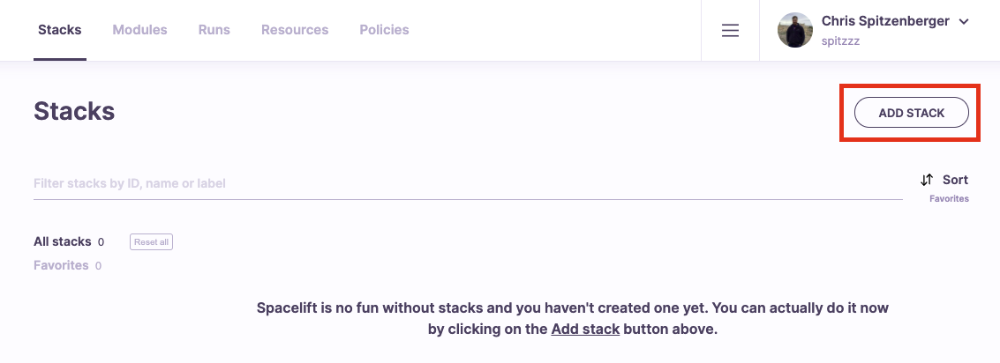
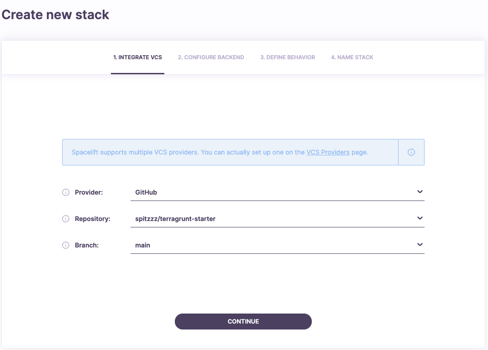
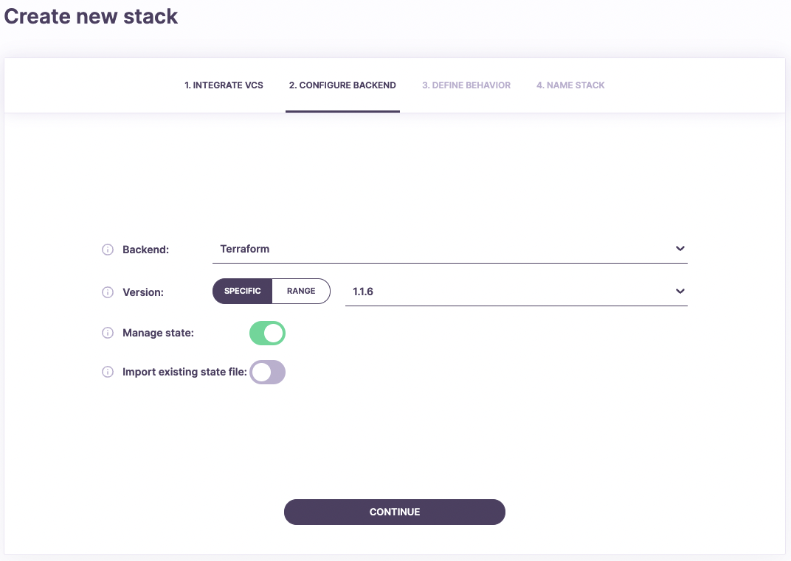
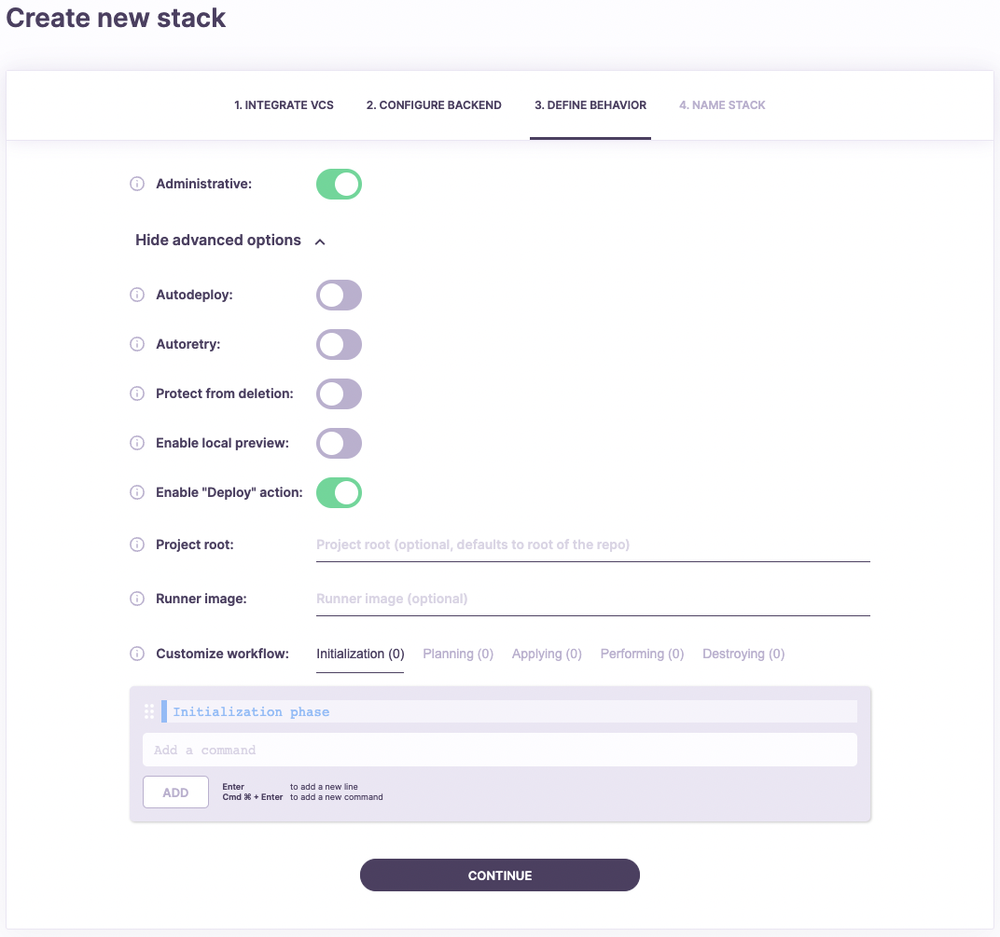
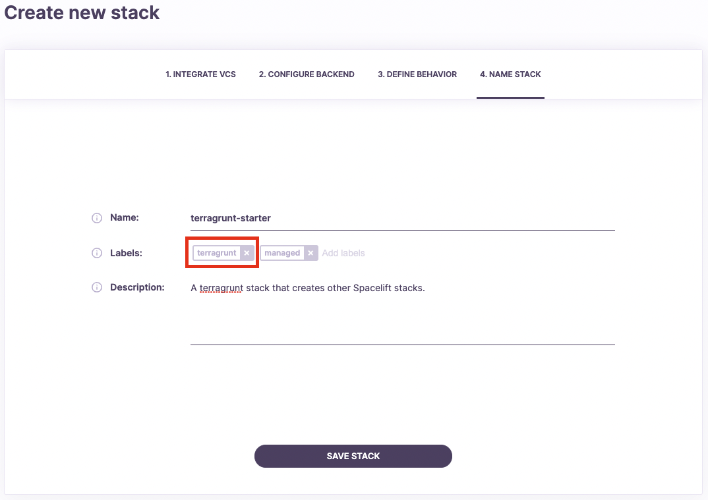
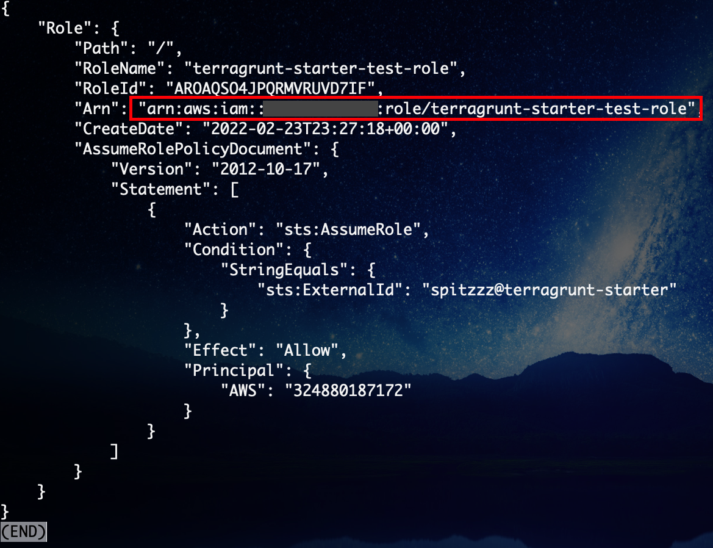
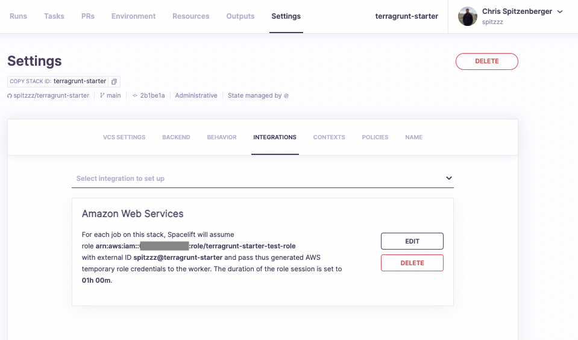
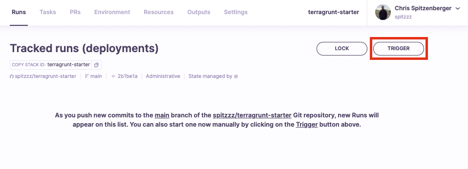
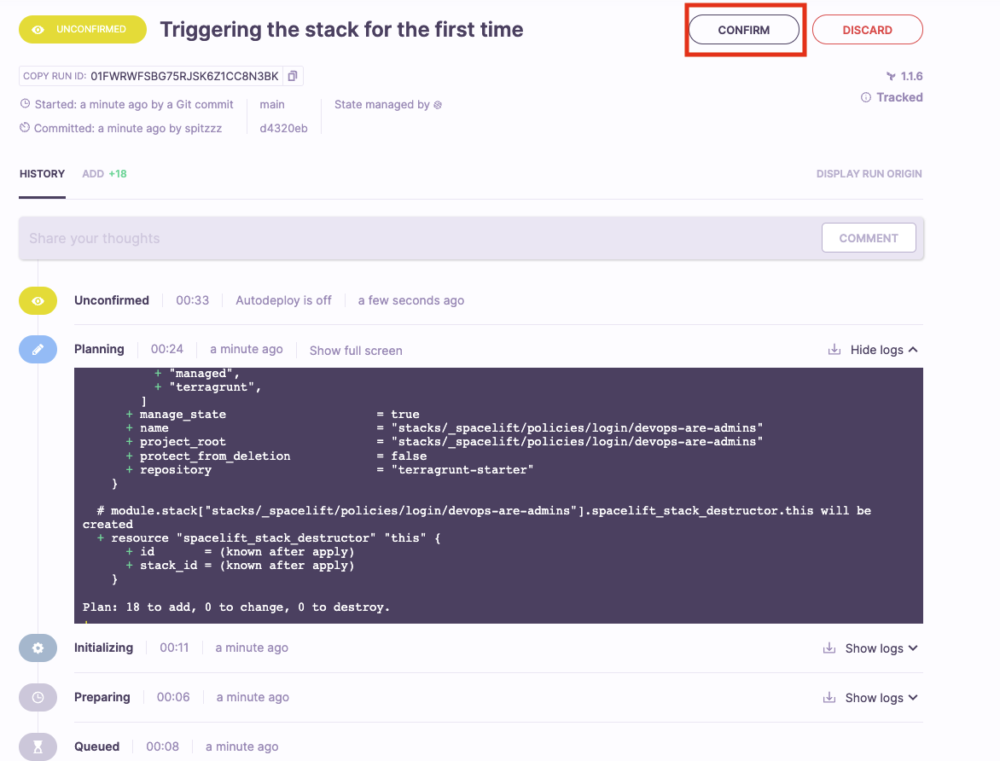

# So you want to use Terragrunt + Spacelift?

The purpose of this repository is to help users get started with using Terragrunt + Spacelift. This repository will enable you to run a terragrunt monorepo on Spacelift where individual folders are created as Spacelift stacks. This gives you all the powers of Spacelift while leveraging your legacy Terragrunt codebase :)

## Pre-requisites:
* Spacelift account already created.
* AWS Account w/ credentials to create an IAM Role

## What does this repository create?
* A dynamic number `n` of Spacelift Stacks: The number of stacks created depends upon the length of the `stacks` input variable in the `terragrunt.hcl` file in the root of this repository.
    * 1 Spacelift AWS Credentials attachment per stack (if `setupAwsIntegration` is true)
        * This attaches an AWS IAM role to the stack
    * 2 Spacelift Stack Policy attachments per stack
* 4 Spacelift Policies
    * (Terragrunt) Ignore Changes Outside Project Root
    * (Terragrunt) Trigger Dependencies
    * (Example) All of Engineering gets read access
    * (Example) DevOps are admins
* 1 AWS IAM Role with `PowerUserAccess`
    * This is the role that will be assumed during `terragrunt` commands

## Customization

To create Spacelift stacks dynamically, each stack will need to be defined in the root `terragrunt.hcl` file. Below is the example of the the attributes that are possible for a single stack within the `stacks` input.

```
{
    "stacks/path/to/folder/you/want/to/be/a/spacelift/stack" : {
        administrative       = bool # https://docs.spacelift.io/concepts/stack/stack-settings#administrative
        autodeploy           = bool # https://docs.spacelift.io/concepts/stack/stack-settings#autodeploy
        enableLocalPreview   = bool # https://docs.spacelift.io/concepts/stack/stack-settings#enable-local-preview
        createOwnIamRole     = bool # Indicates whether or not you'd like an IAM role to be created separately for this stack, default behavior is to share a central IAM role for all stacks.
        setupAwsIntegration  = bool # Whether or not to configure an AWS IAM Role integration for the stack.
        executionRoleArn     = string # Optionally provide your own role ARN to use for the stack AWS Integration. When used, you should also set createOwnIamRole to false.
        workerPoolId         = string # The id of the worker pool to use for the stack. If not specified, will use the public worker pool.
        description          = "Example description of the stack."
        terraformVersion     = string # The version of Terraform to use for the stack.
        additionalLabels     = list(string) # Any additional labels to apply to the stack, "Managed" and "Terragrunt" labels are applied automatically.
        attachmentPolicyIds  = list(string) # Any additional Spacelift policy ids to apply to the stack. By default we create 2 policies: trigger dependencies & ignore files outside root and attach them. 
        attachmentContextIds = list(string) # Any additional Spacelift context ids to apply to the stack.
        dependsOnStacks      = list(string) # Any dependencies to apply to the stack. This will create a "depends-on:<stack>" label for each dependency.
    }
}
```

### Noteworthy Features

* **dependsOnStacks:** You can create dependencies between stacks by adding a list of dependant stack(s) in the `dependsOnStacks` property for a given stack. As the name implies, this allows you to enforce deployment dependencies between stack.
* **Automatic Label Folder Creation:** Label folders will be setup automatically using your folder structure, allowing you to filter through your Spacelift stacks easier.
* **Automatic setup of 2 Policies:** For all stacks created, a trigger dependencies policy & ignore files outside root policy will be automatically attached. These 2 policies are beneficial when working with this terragrunt monorepo on Spacelift.
* **Account Shared Context:** For all stacks created, a shared context is automatically attached to every stack. You can use this context if there is any special information you need to share globally across all stacks. The name of this context is called `${var.spaceliftAccountName}-shared-context`
* **Stack IAM Role Customization:** Don't want us to create a role for your Spacelift stack(s) to use? You can specify your own role for a given stack to use by setting `createOwnIamRole: false` `executionRoleArn: <roleArn>` for a given stack.

## Deployment Steps

### Step 1: Create your repository

Create your own GitHub repository using this repository as a template. To do this, click the [Use this template](https://github.com/spacelift-io/terragrunt-starter/generate/) button on this repository. If you are using a different version control provider, you can also clone down this repository locally and initialize it into your own version control system as a new repository.

[](https://github.com/spacelift-io/terragrunt-starter/generate/)

---

### Step 2: Create your Spacelift stack

Login to your Spacelift account, and while on the **Stacks** tab, click the "Add Stack" button.



---

### Step 3: Stack Configuration: Integrate VCS

Select your version control system (GitHub used in this example), then select the repository that you created with this codebase. For the branch selection, select the branch which you would like [tracked runs](https://docs.spacelift.io/concepts/run/tracked) to be triggered for by default. Tracks runs are runs which will deploy changes. Whether or not you will require approval for changes to be deployed comes in a future step.

NOTE: If the repository you created is not showing up, you may need to update Spacelift's access to your repositories. For GitHub, you can update your access settings from [this link](https://github.com/apps/spacelift-io/installations/new). If you experience this issue with another VCS provider, you can update your access settings under `Account Settings > VCS Providers` within Spacelift.



---

### Step 4: Stack Configuration: Configure Backend

Ensure you select "Terraform" for the Backend, as the entire purpose of this is to use Terragrunt, a wrapper for Terraform. As far as the other configuration, that's up to you. We typically enjoy using the default settings here.



---

### Step 5: Stack Configuration: Define Behavior

`IMPORTANT` You'll need to make sure Administratrive is set to `true` on this step! It's also important that you do not change the project root. All other settings can be set as you desire. If you would like to require approval for tracked runs (runs to-be applied), ensure that autodeploy is disabled. You can customize your approval process later if needed by attaching [approval policies](https://docs.spacelift.io/concepts/policy/approval-policy) to this stack.



---

### Step 6: Stack Configuration: Name Stack

`IMPORTANT` You'll need to ensure you have the `terragrunt` label on your stack. This tells Spacelift to use terragrunt for all commands. In regards to naming your stack and other labels, you can do whatever you'd like!



---

### Step 7: Setup AWS Integration: Create an IAM Role to use

With your stack created, we need to setup the AWS Integration to allow the stack to create resources on AWS. This is important because one of the powerful features of this example allows for the ability to re-use a single IAM Role across your generated Spacelift stacks. You won't be able to create this IAM Role unless you configure your primary stack to be able to create it. With that said, you'll need to go into your AWS account and create this role manually, or run the following script with valid AWS credentials to create the role.

`NOTE:` Ensure you replace ROLE_NAME with the name of the role to create.

`NOTE:` Ensure you replace STACK_ID with the id of the stack you created.

```
ROLE_NAME="CHANGE-THIS-ROLE-NAME-TO-CREATE"
SPACELIFT_ACCOUNT_ID="CHANGE-THIS-YOUR-SPACELIFT-ACCOUNT-ID"
STACK_ID="CHANGE-THIS-ID-OF-THE-STACK"
cat << EOF > trust-policy.json
{
    "Version": "2012-10-17",
    "Statement": [
        {
        "Action": "sts:AssumeRole",
        "Condition": {
            "StringEquals": {
            "sts:ExternalId": "$SPACELIFT_ACCOUNT_ID@$STACK_ID"
            }
        },
        "Effect": "Allow",
        "Principal": {
            "AWS": "324880187172"
        }
        }

    ]
}
EOF
aws iam create-role --role-name $ROLE_NAME --assume-role-policy-document file://trust-policy.json
aws iam attach-role-policy --policy-arn arn:aws:iam::aws:policy/AdministratorAccess --role-name $ROLE_NAME
```

After running this script, you should get an output similar to the following which contains the ARN of the role you just created. **Copy the value you the ARN of the role**, as we will need that in the next step.



Paste the value of role ARN into the input box and click **Save**.


Success should look like below:



---

### Step 8: Triggering your stack

You're all setup! You can now trigger your stack for the first time! Keep in mind, when you trigger this stack, it utilizes the inputs from the root `terragrunt.hcl` file to generate stacks for any specified folder paths in this repository.



### Step 9: Confirm Deployment

Assuming everything went well, if you configured your stack for `autodeploy: false` you will be prompted to Confirm the deployment. Press the Confirm button to do so.



---

## Limitations

* Currently this example only supports AWS, but feel free to open a pull request to add new functionality. You should be able to follow the same approach for other cloud providers, and we plan to add more examples of this in the future.
