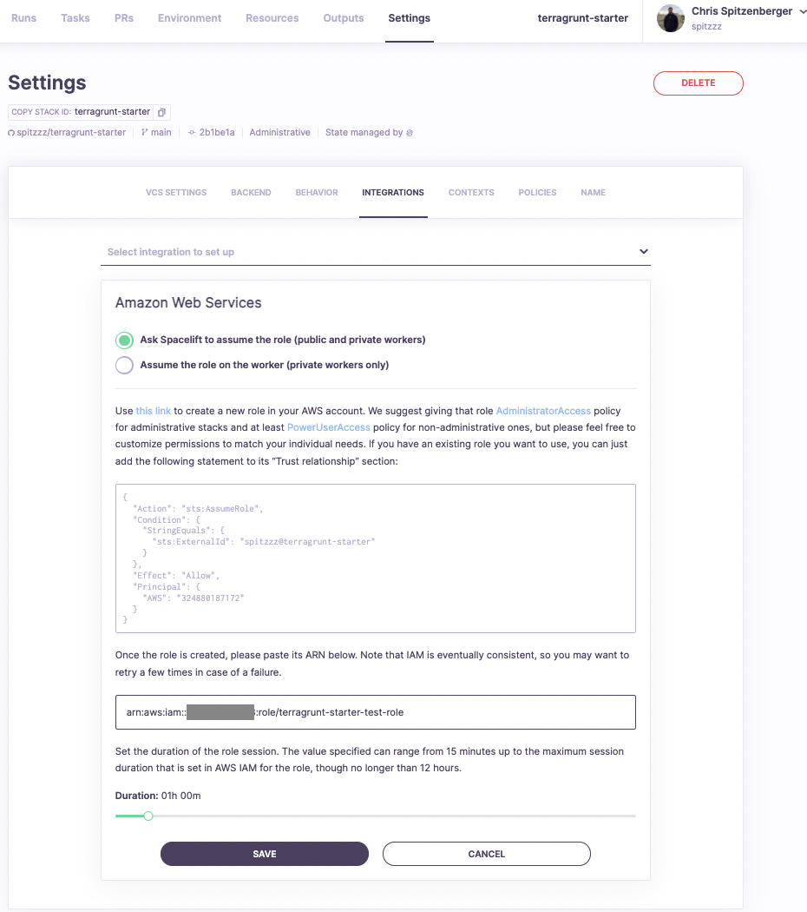

# So you want to use Terragrunt + Spacelift?

The purpose of this repository is to help users get started with using Terragrunt + Spacelift. This repository will enable you to run a terragrunt monorepo on Spacelift where individual folders are created as Spacelift stacks. This gives you all the powers of Spacelift while leveraging your legacy Terragrunt codebase :)

## Pre-requisites:
* Spacelift account already created.
* AWS Account Access w/ permissions to create IAM Roles
    * AWS CLI Installed/Configured Locally

## What does this repository create?
* A dynamic number `n` of Spacelift Stacks: The number of stacks created depends upon the length of the `stacks` input variable in the `terragrunt.hcl` file in the root of this repository.
    * 1 Spacelift AWS Credentials attachment per stack
        * This attaches the AWS IAM role to the stack
    * 2 Spacelift Stack Policy attachments per stack
* 1 AWS IAM Role with `PowerUserAccess`
    * This is the role that will be assumed during `terragrunt` commands

## Step 1: Create your repository

Create your own GitHub repository using this repository as a template. To do this, click the [Use this template](https://github.com/spacelift-io/terragrunt-starter/generate/) button on this repository. If you are using a different version control provider, you can also clone down this repository locally and initialize it into your own version control system as a new repository.

[](https://github.com/spacelift-io/terragrunt-starter/generate/)

---

## Step 2: Create your Spacelift stack

Login to your Spacelift account, and while on the **Stacks** tab, click the "Add Stack" button.


---

## Step 3: Stack Configuration: Integrate VCS

Select your version control system (GitHub used in this example), then select the repository that you created with this codebase. For the branch selection, select the branch which you would like [tracked runs](https://docs.spacelift.io/concepts/run/tracked) to be triggered for by default. Tracks runs are runs which will deploy changes. Whether or not you will require approval for changes to be deployed comes in a future step.

NOTE: If the repository you created is not showing up, you may need to update Spacelift's access to your repositories. For GitHub, you can update your access settings from [this link](https://github.com/apps/spacelift-io/installations/new). If you experience this issue with another VCS provider, you can update your access settings under `Account Settings > VCS Providers` within Spacelift.


---

## Step 4: Stack Configuration: Configure Backend

Ensure you select "Terraform" for the Backend, as the entire purpose of this is to use Terragrunt, a wrapper for Terraform. As far as the other configuration, that's up to you. We typically enjoy using the default settings here.


---

## Step 5: Stack Configuration: Define Behavior

`IMPORTANT` You'll need to make sure Administratrive is set to `true` on this step! It's also important that you do not change the project root. All other settings can be set as you desire. If you would like to require approval for tracked runs (runs to-be applied), ensure that autodeploy is disabled. You can customize your approval process later if needed by attaching [approval policies](https://docs.spacelift.io/concepts/policy/approval-policy) to this stack.


---

## Step 6: Stack Configuration: Name Stack

`IMPORTANT` You'll need to ensure you have the `terragrunt` label on your stack. This tells Spacelift to use terragrunt for all commands. In regards to naming your stack and other labels, you can do whatever you'd like!


---

## Step 7: Setup AWS Integration: Create an IAM Role to use

With your stack created, we need to setup the AWS Integration to allow the stack to create resources on AWS. This is important because one of the powerful features of this example allows for the ability to re-use a single IAM Role across your generated Spacelift stacks. You won't be able to create this IAM Role unless you configure your primary stack to be able to create it. With that said, you'll need to go into your AWS account and create this role manually, or run the following script with valid AWS credentials to create the role.

`NOTE:` Ensure you replace ROLE_NAME with the name of the role to create.

`NOTE:` Ensure you replace STACK_ID with the id of the stack you created.

```
ROLE_NAME="CHANGE-THIS-ROLE-NAME-TO-CREATE"
SPACELIFT_ACCOUNT_ID="CHANGE-THIS-YOUR-SPACELIFT-ACCOUNT-ID"
STACK_ID="CHANGE-THIS-ID-OF-THE-STACK"
cat << EOF > trust-policy.json
{
    "Version": "2012-10-17",
    "Statement": [
        {
        "Action": "sts:AssumeRole",
        "Condition": {
            "StringEquals": {
            "sts:ExternalId": "$SPACELIFT_ACCOUNT_ID@$STACK_ID"
            }
        },
        "Effect": "Allow",
        "Principal": {
            "AWS": "324880187172"
        }
        }

    ]
}
EOF
aws iam create-role --role-name $ROLE_NAME --assume-role-policy-document file://trust-policy.json
aws iam attach-role-policy --policy-arn arn:aws:iam::aws:policy/AdministratorAccess --role-name $ROLE_NAME
```

After running this script, you should get an output similar to the following which contains the ARN of the role you just created. **Copy the value you the ARN of the role**, as we will need that in the next step.


Paste the value of role ARN into the input box and click **Save**.



Success should look like below:


---

## Step 8: Triggering your stack

You're all setup! You can now trigger your stack for the first time! Keep in mind, when you trigger this stack, it utilizes the inputs from the root `terragrunt.hcl` file to generate stacks for any specified folder paths in this repository.


